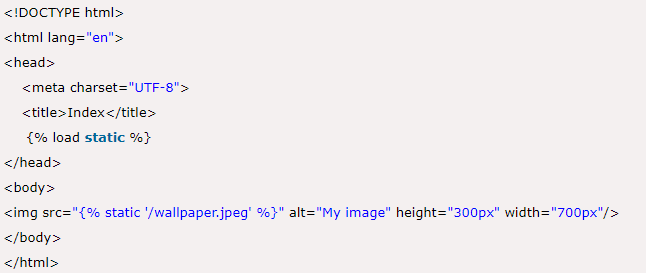

# Django-documentation
## Table of Contents:
  * Django Templates
  * Static File Handling
## Template:
  * A template consists of static parts of the desired HTML output as well as some special syntax describing how dynamic content will be inserted.
## Why Django Template?
  * In HTML file, we can't write python code because the code is only interpreted by python interpreter not the browser. We know that HTML is a static markup language, while Python is a dynamic programming language
## Django Template Configuration:
  * To configure the template system, we have to provide some entries in settings.py file.
  

  * Here, we mentioned that our template directory name is templates. By default, DjangoTemplates looks for a templates subdirectory in each of the INSTALLED_APPS.
  *  Register app inside the INSTALLED_APPS
  
 
   
## Django Template Simple Example:
  * First, create a directory templates inside the project app as we did below
  

  * After that create a template index.html inside the created folder.
  
  

  * Our template index.html contains the following code.
  

## Loading Template:
  * To load the template, call get_template() method as we did below and pass template name.
  * views.py
  

  * Set a URL to access the template from the browser
  * urls.py
         path('index/', views.index), 
  * Run Server:
        python manage.py runserver
  * Execute the following command and access the template by entering localhost:8000/index at the browser.
  
  

## Static Files Handling
  * In a web application, apart from business logic and data handling, we also need to handle and manage static resources like CSS, JavaScript, images etc.
     It is important to manage these resources so that it does not affect our application performance.
  * Django deals with it very efficiently and provides a convenient manner to use resources.
  * The django.contrib.staticfiles module helps to manage them.
  
## Django Static (CSS, JavaScript, images) Configuration:
  * Include the django.contrib.staticfiles in INSTALLED_APPS.
  

  * Define STATIC_URL in settings.py file as given below.
  

  * Load static files in the templates by using the below expression.
  

  * Store all images, JavaScript, CSS files in a static folder of the application. First create a directory static, store the files inside it.
  
  

  * Our project structure looks like this.

## Django Image Loading Example:
  * To load an image in a template file, use the code given below.
  * index.html

  * //urls.py
  

  * //views.py
  
  

  * Run the server by using python manage.py runserver command.
  * After that access the template by localhost:8000/index URL, and it will produce the following output to the browser.

## Django Loading JavaScript:

  * To load JavaScript file, just add the following line of code in index.html file

  * // index.html 
  
  

  * // // script.js  
  * alert("Hello, Welcome to Javatpoint");
  

  * Run the server by using python manage.py runserver command.

  * After that access the template by localhost:8000/index URL, and it will produce the following output to the browser.
  
  
 
 
 ## Django Loading CSS Example:
  * To, load CSS file, use the following code in index.html file
  
   
 
 
  * After that create a directory CSS and file style.css which contains the following code.
  * // style.css
  
   
 
 
  * To, load CSS file, use the following code in index.html file
  
  
    
 
 
  * // index.html
  
  
    
 
  * Run the server by using python manage.py runserver command
  * After that access the template by entering localhost:8000/index URL,and it will produce the following output in the browser.
  
  
  
 
  
  

  
  
 

  

